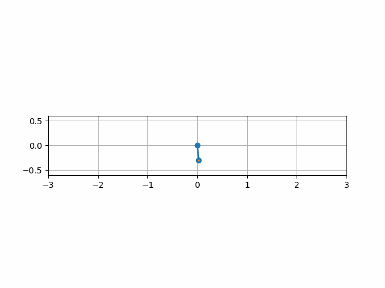

# Inverse-pendulum-control

Welcome to the repository of my 3rd year of Bachelor's degree personal project on controlling and stabilizing a pendulum to a point of unstable equilibrium

Here's a demo of the end result simulated and visualized :

To check out full project, [click here to view the project page](https://nonoxali.github.io/Inverse-pendulum-control/)
